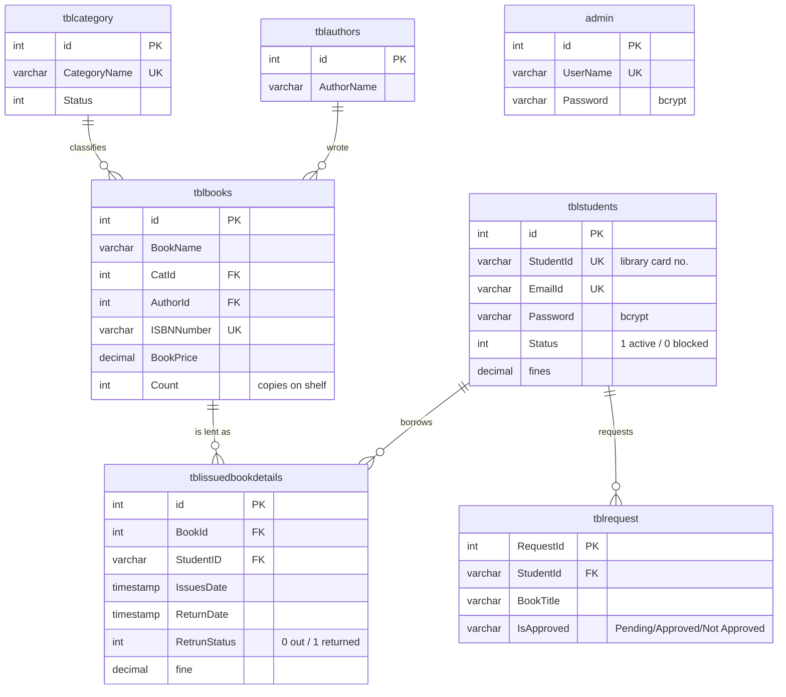
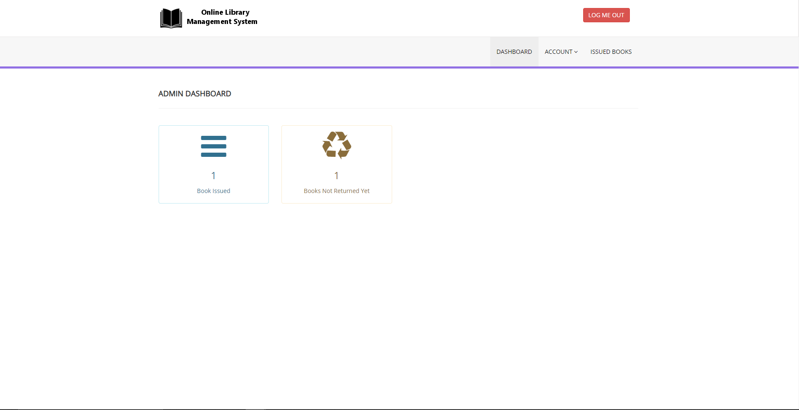

# Library Management System

A web-based circulation system for a small academic library: members search the
catalogue, borrow and return books, and raise acquisition requests; the
librarian manages the catalogue, issues and returns copies, tracks fines and
chases overdue loans.

Built as a course project and since reworked into a documented reference
implementation — the emphasis is on the parts that a working library system
actually has to get right: **a normalised schema, transactional circulation, an
explicit loan policy, and an authentication layer that is safe to deploy.**

| | |
|---|---|
| **Stack** | PHP 7.4+ (no framework), MySQL 5.7+ / MariaDB 10.3+, Bootstrap 3, jQuery |
| **Architecture** | Server-rendered pages over a thin domain layer (`includes/`) |
| **Data model** | 7 tables, foreign keys, InnoDB, utf8mb4 |
| **Security** | bcrypt passwords, CSRF tokens, prepared statements, POST-only state changes |
| **Tests** | `php tests/run-tests.php` (17 assertions) + `tests/stress/` (20,000-operation fuzz, concurrency and schema checks, no PHP needed) |

---

## 1. Features

### Member portal

| Page | What it does |
|---|---|
| `signup.php` | Self-registration; allocates a library card number (`SID017`, `SID018`, …) under a file lock, validates e-mail/mobile/password, checks e-mail availability over AJAX |
| `index.php` | Login; bcrypt verification, session regeneration, blocked-account handling |
| `dashboard.php` | Books borrowed, currently on loan (against the per-member limit), overdue count, fine payable |
| `available-books.php` | Catalogue search across **title, author and ISBN**, with live copy availability |
| `issued-books.php` | Personal loan history with due dates, overdue days and the fine accruing on each loan |
| `book-requests.php` | Request a title the library does not stock; shows the librarian's decision |
| `my-profile.php` | Profile, registration date, outstanding fine balance |
| `change-password.php` | Password change with current-password verification |

### Librarian panel (`admin/`)

| Page | What it does |
|---|---|
| `dashboard.php` | Eight live indicators — titles, copies on shelf, members, blocked members, books out, overdue loans, pending requests, fines outstanding — each linking to the filtered list |
| `add-book.php`, `manage-books.php`, `edit-book.php` | Catalogue CRUD; ISBN validation, author de-duplication, deletion blocked while copies are on loan |
| `add-category.php`, `manage-categories.php`, `edit-category.php` | Classification CRUD; deletion blocked while books reference the category |
| `manage-authors.php`, `edit-author.php` | Author list, kept in step with the books table |
| `issue-book.php` | Issue a copy; AJAX member and title lookup, with every circulation rule checked before the ledger is touched |
| `manage-issued-books.php` | Circulation ledger, filterable by **all / on loan / overdue**, with the fine accrued to date |
| `update-issue-bookdeails.php` | Return a copy; the fine is **pre-computed from the loan policy** and may be overridden (waiver, dispute) |
| `mail-student.php` | Every member holding an overdue book, with a one-click reminder e-mail itemising their loans and fines |
| `reg-students.php` | Member list; block / re-activate accounts |
| `book-request.php` | Approve or decline acquisition requests, filterable by status |

---

## 2. Architecture

```
Browser
   │  HTTP (server-rendered HTML, small AJAX fragments)
   ▼
┌──────────────────────────────────────────────────────────────┐
│  Presentation — page scripts                                 │
│  *.php (member portal)          admin/*.php (librarian)      │
└───────────────┬──────────────────────────────────────────────┘
                │ calls lms_* helpers only
                ▼
┌──────────────────────────────────────────────────────────────┐
│  Domain / support layer — includes/                          │
│    config.php    bootstrap, credentials, policy constants    │
│    auth.php      passwords, sessions, CSRF, escaping         │
│    library.php   loan rules, fines, issue/return transactions│
│    admin/includes/notify.php   overdue reminder mail         │
└───────────────┬──────────────────────────────────────────────┘
                │ PDO, prepared statements, transactions
                ▼
┌──────────────────────────────────────────────────────────────┐
│  MySQL / InnoDB — 7 tables, foreign keys, utf8mb4            │
└──────────────────────────────────────────────────────────────┘
```

The page scripts stay presentation code. Anything that encodes a *library rule*
— how long a book may be kept, how a fine accrues, whether a member may borrow
another copy — lives in `includes/library.php`, and its parameters live as
constants in `includes/config.php`. Changing `LOAN_PERIOD_DAYS` changes issuing,
the member's due dates, the fine calculation, the overdue filter and the
reminder e-mails in one edit.

`admin/includes/config.php` simply requires the root bootstrap, so both halves
of the application share one database handle, one policy and one set of helpers.

### Entity–relationship model



`tblbooks.Count` is the number of copies **on the shelf**, not the number owned:
issuing decrements it, returning restores it, and both happen inside the same
transaction as the ledger write.

---

## 3. Business rules

Defined once in `includes/config.php` and applied by `includes/library.php`:

| Constant | Default | Meaning |
|---|---|---|
| `LOAN_PERIOD_DAYS` | 14 | Days a copy may be kept before a fine starts |
| `FINE_PER_DAY` | 5.00 | INR charged for each day past the due date |
| `MAX_BOOKS_PER_USER` | 3 | Simultaneous open loans per member |

An issue request is refused, with a specific reason, when the member does not
exist, is blocked, already holds that title, has reached the loan limit, or no
copy is on the shelf (`lms_issue_blocker()`).

    fine = max(0, days_since_issue − LOAN_PERIOD_DAYS) × FINE_PER_DAY

The fine is computed for the librarian on the return screen and may be edited
before it is committed, which is what a waiver or a disputed date needs in
practice.

---

## 4. Getting started

### Requirements

* PHP 7.4 or newer with `pdo_mysql` (XAMPP, LAMP, MAMP or a bare PHP + MySQL)
* MySQL 5.7+ or MariaDB 10.3+

### Install

```bash
# 1. Put the project where the web server can serve it
git clone <your-fork-url> library
# XAMPP: C:\xampp\htdocs\library   |   LAMP: /var/www/html/library

# 2. Create the schema and the seed data
mysql -u root -p < database/library.sql

# 3. Tell the application how to reach the database (pick one)
cp includes/config.local.php.example includes/config.local.php   # edit it, or
export LMS_DB_USER=library_app LMS_DB_PASS=secret                # use the environment

# 4. Serve it
php -S localhost:8000          # or browse to http://localhost/library
```

Open `http://localhost:8000/` for the member portal and
`http://localhost:8000/admin/` for the librarian panel.

### Default credentials

| Role | Username / e-mail | Password |
|---|---|---|
| Librarian | `admin` | `Test@123` |

**Change this immediately** — Admin → Change Password. The seed hash is public
in `database/library.sql`, so it is a demo credential, never a deployment one.
Member accounts are created through the signup form.

### Configuration

| Setting | Environment variable | Default |
|---|---|---|
| Database host | `LMS_DB_HOST` | `localhost` |
| Database user | `LMS_DB_USER` | `root` |
| Database password | `LMS_DB_PASS` | *(empty)* |
| Database name | `LMS_DB_NAME` | `library` |
| Show PHP errors | `LMS_DEBUG` | `false` (errors go to the log) |
| Reminder sender | `LMS_MAIL_FROM` | `library@localhost` |

`includes/config.local.php` overrides all of these and is gitignored, so
credentials never reach the repository.

---

## 5. Security

The original coursework version stored unsalted md5 password digests, changed
state through `GET` links, and interpolated query results straight into HTML.
The current version addresses each of those:

| Area | Approach |
|---|---|
| **Password storage** | `password_hash()` / `password_verify()` (bcrypt). Accounts still holding a legacy md5 digest are accepted **once** and silently re-hashed on that login, so an existing installation upgrades without a password reset (`lms_verify_password`, `lms_upgrade_password`) |
| **SQL injection** | PDO prepared statements everywhere, with `ATTR_EMULATE_PREPARES => false` so the placeholders are bound by the server |
| **XSS** | All dynamic output escaped through `e()` (`htmlspecialchars`, `ENT_QUOTES`, UTF-8) |
| **CSRF** | Per-session token in every state-changing form; `lms_csrf_verify()` rejects mismatches with HTTP 400 |
| **State changes over GET** | Removed. Deleting a book, blocking a member or approving a request is a POST form, not a link a crawler or a pre-fetcher can follow |
| **Privilege escalation** | `issued-books.php` used to accept `?del=<id>` and delete that row from `tblbooks` — any logged-in member could erase the catalogue. Deletion now exists only in the admin panel |
| **Session fixation** | `session_regenerate_id(true)` on every successful login; cookies are `HttpOnly`, `SameSite=Lax`, and `Secure` under HTTPS |
| **Account enumeration** | Login failures return one message whether the e-mail is unknown or the password is wrong |
| **Data leakage** | A member's request list shows only their own requests (it previously listed every member's) |
| **Error handling** | `error_reporting(0)` replaced by logging; database errors are logged, not shown to the visitor |
| **Credentials** | Read from the environment or a gitignored local file rather than committed |

Known limitations are listed in §8.

---

## 6. Project layout

```
.
├── index.php, signup.php, dashboard.php, …   Member portal
├── check_availability.php                    AJAX: e-mail availability
├── includes/
│   ├── config.php            Bootstrap: credentials, policy constants, PDO handle
│   ├── config.local.php.example
│   ├── auth.php              Passwords, sessions, CSRF, output escaping
│   ├── library.php           Loan rules, fines, issue/return transactions, flashes
│   ├── header.php, footer.php
├── admin/
│   ├── dashboard.php, add-book.php, issue-book.php, …   Librarian panel
│   ├── get_book.php, get_student.php                    AJAX lookups
│   └── includes/
│       ├── config.php        Requires the shared bootstrap
│       └── notify.php        Overdue reminder e-mail
├── database/library.sql      Schema + seed data (idempotent)
├── tests/run-tests.php       Dependency-free test runner
├── docs/
│   ├── ARCHITECTURE.md       Design decisions and request walkthroughs
│   └── TESTING.md            Manual test checklist
├── Images/                   Screenshots
└── assets/                   Bootstrap, Font Awesome, jQuery, DataTables
```

---

## 7. Testing

```bash
php tests/run-tests.php
```

Covers the logic that needs no database: due dates, overdue days, the fine
formula (including a fine frozen at the return date), bcrypt verification, the
legacy-md5 acceptance path, rehash detection, and card-number allocation
(including the `SID099 → SID100` rollover).

Flows that need a database — issuing, returning, blocking, requests — are
covered by the checklist in [docs/TESTING.md](docs/TESTING.md).

The design itself is stress-tested without PHP or MySQL:

```bash
python3 tests/stress/schema_check.py     # every table/column the PHP uses exists
python3 tests/stress/bind_check.py       # every SQL placeholder is bound
python3 tests/stress/guard_check.py      # auth + CSRF coverage, page by page
python3 tests/stress/stress.py           # 20,000-operation fuzz, 6 invariants
python3 tests/stress/scenarios.py        # contention, races, fine boundaries
python3 tests/stress/race_loan_limit.py  # regression: concurrent issues to one member
```

`includes/library.php` is ported statement-for-statement onto SQLite (using the
real DDL, keys included) and driven hard. This found a TOCTOU race in the
per-member loan rules, described in
[tests/stress/README.md](tests/stress/README.md).

---

## 8. Limitations and further work

* **Reservations / holds.** A member who finds every copy on loan cannot queue
  for the next one.
* **Fine settlement.** `tblstudents.fines` accumulates but there is no payment
  or waiver ledger; only the total is tracked.
* **Reminder delivery.** `mail()` is used directly; a real deployment wants a
  queue and an SMTP transport, and reminders should be scheduled by cron rather
  than clicked.
* **Single librarian role.** The `admin` table has no roles or permissions.
* **Front-end vintage.** Bootstrap 3 and jQuery 1.10 are the original
  coursework choices and were deliberately left in place.
* **Rate limiting.** Login attempts are not throttled.

---

## 9. Screenshots

Captured from the original coursework build. The Bootstrap 3 shell is
unchanged; the dashboards and tables carry more information now (and the login
form no longer uses the captcha shown below).

| Member login | Member dashboard |
|---|---|
|  |  |

---

## 10. License

Released under the MIT License — see [LICENSE](LICENSE).
